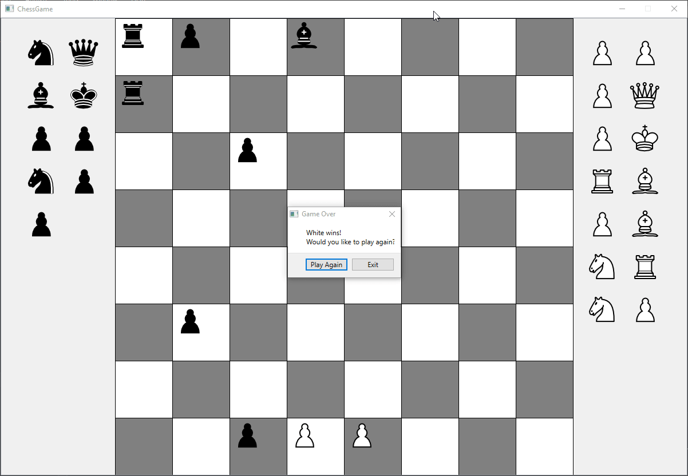

# QtChess-Defeat-the-AI

This chess game, implemented using C++ and built with Qt, features two unique AI opponents: **Random AI** and **One Step Ahead AI** you can choose to play against. Unlike traditional chess programs, this game does not use a matrix representation for the board. Instead, it manages all game information through a list of chess pieces.

## Objective:

The player who loses all their pieces first wins! Additionally, if a player is left with only an immovable pawn, they also win. When a player can capture a piece of the opponent, they must do so.

## AI Strategies:

- **Random AI:** Makes moves at random, including random choices for pawn promotion.
- **One Step Ahead AI:** Strategically aims to force the opponent into making captures. It evaluates the immediate consequences of moves and prefers pawn promotions that do not immediately lead to the capturing of the opponent's pieces. It tries to compel the opponent to capture, looking slightly ahead to anticipate the game's potential outcomes.

## Game Interface built in Qt:

The game starts with an initial screen where the player can choose a color and AI mode. White always goes first. When it is the player's turn, the pieces they can move are highlighted in green. Once a piece is selected, it is highlighted in red, and the squares to which it can move are also highlighted in red. Captured pieces are removed from the board and displayed on the side corresponding to the color of the player who captured them (e.g., if White captures a Black piece, the Black piece is shown on the Black side).

When the game ends, a pop-up announces the winning color, and the player is given the option to play again or exit the game.

